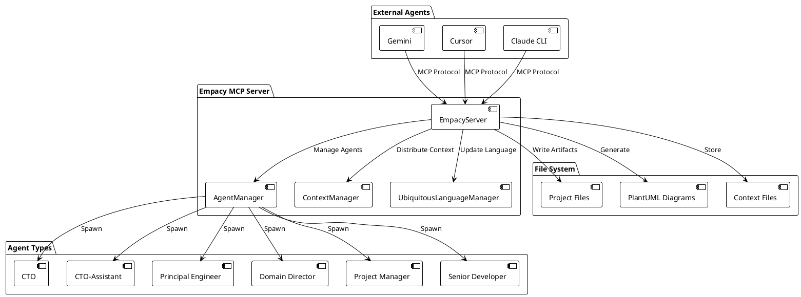
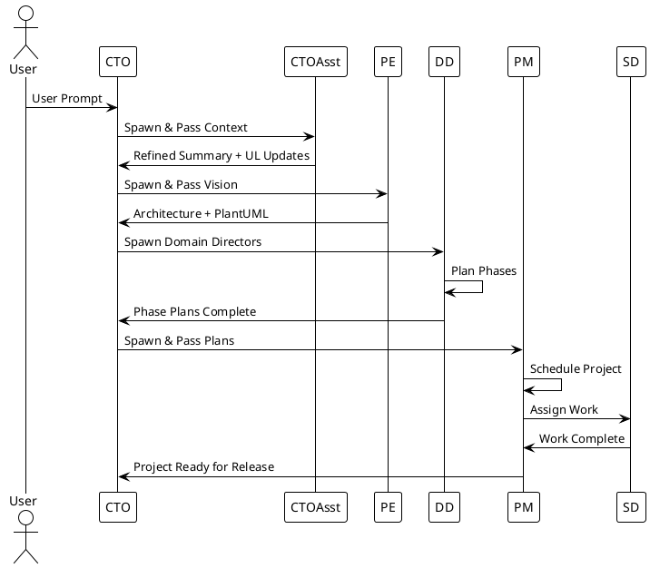

# Empacy Workflow Example: Creating a TODO App

This document demonstrates the complete multi-agent workflow using the Empacy MCP server to create a TODO application from scratch.

## 1. Environment Setup

### Global NPM Installation
```bash
# Install Empacy globally
npm install -g empacy

# Start the Empacy MCP server as a background service
empacy start --daemon --port 5000
```

### Docker Alternative
```bash
# Run Empacy in Docker
docker run -d -p 5000:5000 --name empacy-server anthonyruffino/empacy:latest

# Or use docker-compose
cat > docker-compose.yml << 'EOF'
version: '3.8'
services:
  empacy:
    image: anthonyruffino/empacy:latest
    ports:
      - "5000:5000"
    volumes:
      - ./projects:/app/projects
    environment:
      - NODE_ENV=production
EOF

docker-compose up -d
```

### Agent Configuration Files

#### Gemini (Google AI Studio)
```json
// mcp-servers.json
{
  "mcpServers": {
    "empacy": {
      "command": "empacy",
      "args": ["start", "--stdio"],
      "env": {}
    }
  }
}
```

#### Cursor
```json
// ~/.cursor/settings.json
{
  "mcp.servers": {
    "empacy": {
      "command": "empacy",
      "args": ["start", "--stdio"],
      "env": {}
    }
  }
}
```

#### Claude CLI
```bash
# ~/.claude/config.json
{
  "mcp": {
    "servers": {
      "empacy": {
        "command": "empacy",
        "args": ["start", "--stdio"],
        "env": {}
      }
    }
  }
}
```

## 2. User Prompt

> "I need a new TODO app for managing my daily tasks. It should have basic CRUD operations, user authentication, and a clean interface. I prefer React for the frontend and Node.js for the backend."

## 3. CTO Workflow

### 3.1 Initial Project Creation

The CTO receives the user prompt and creates a new project:

```json
// MCP Call: createProject
{
  "method": "createProject",
  "params": {
    "name": "TODO App",
    "description": "A modern TODO application with React frontend and Node.js backend, featuring CRUD operations and user authentication",
    "domains": ["frontend", "backend", "infrastructure", "database", "authentication"]
  }
}
```

**Response:**
```json
{
  "success": true,
  "projectId": "project_1703123456789_abc123def",
  "status": "created"
}
```

### 3.2 CTO-Assistant Interaction

The CTO spawns the CTO-Assistant to refine the user prompt and update ubiquitous language:

```json
// MCP Call: spawnAgent
{
  "method": "spawnAgent",
  "params": {
    "role": "cto-assistant",
    "context": {
      "projectId": "project_1703123456789_abc123def",
      "userPrompt": "I need a new TODO app for managing my daily tasks. It should have basic CRUD operations, user authentication, and a clean interface. I prefer React for the frontend and Node.js for the backend."
    }
  }
}
```

**Response:**
```json
{
  "success": true,
  "agentId": "agent_1703123456789_cto_asst_001",
  "status": "spawned"
}
```

The CTO-Assistant processes the prompt and updates ubiquitous language:

```json
// MCP Call: updateUbiquitousLanguage
{
  "method": "updateUbiquitousLanguage",
  "params": {
    "concepts": [
      {
        "name": "TODO Application",
        "short-name": "TA",
        "definition": "A task management application for organizing daily activities",
        "domain": "application"
      },
      {
        "name": "CRUD Operations",
        "short-name": "CRUD",
        "definition": "Create, Read, Update, Delete operations for task management",
        "domain": "backend"
      },
      {
        "name": "User Authentication",
        "short-name": "UA",
        "definition": "System for verifying user identity and managing access",
        "domain": "authentication"
      }
    ]
  }
}
```

### 3.3 CTO File Creation

The CTO creates the strategic documents using MCP file operations:

#### Vision Document
```json
// MCP Call: writeFile
{
  "method": "writeFile",
  "params": {
    "path": "./projects/project_1703123456789_abc123def/vision.md",
    "content": "# TODO App Vision\n\n## Overview\nA modern, user-friendly task management application that helps users organize their daily activities efficiently.\n\n## Key Features\n- Task CRUD operations\n- User authentication and authorization\n- Clean, intuitive interface\n- Responsive design\n\n## Technology Stack\n- Frontend: React with TypeScript\n- Backend: Node.js with Express\n- Database: PostgreSQL\n- Authentication: JWT tokens"
  }
}
```

#### Domain Design
```json
// MCP Call: writeFile
{
  "method": "writeFile",
  "params": {
    "path": "./projects/project_1703123456789_abc123def/domain-design.md",
    "content": "# TODO App Domain Design\n\n## Domain Breakdown\n\n### Frontend Domain\n- React components and state management\n- User interface and user experience\n- Responsive design and accessibility\n\n### Backend Domain\n- API endpoints and business logic\n- Data validation and error handling\n- Performance optimization\n\n### Infrastructure Domain\n- Deployment and hosting\n- CI/CD pipelines\n- Monitoring and logging\n\n### Database Domain\n- Data modeling and schema design\n- Query optimization\n- Data migration strategies\n\n### Authentication Domain\n- User registration and login\n- JWT token management\n- Security best practices"
  }
}
```

#### Milestones Document
```json
// MCP Call: writeFile
{
  "method": "writeFile",
  "params": {
    "path": "./projects/project_1703123456789_abc123def/milestones.md",
    "content": "# TODO App Milestones\n\n## Phase 1: Foundation (Weeks 1-2)\n- Project setup and architecture planning\n- Basic project structure creation\n- Development environment configuration\n\n## Phase 2: Core Development (Weeks 3-6)\n- Backend API development\n- Frontend component creation\n- Database schema implementation\n\n## Phase 3: Integration (Weeks 7-8)\n- Frontend-backend integration\n- Authentication system implementation\n- Testing and bug fixes\n\n## Phase 4: Deployment (Weeks 9-10)\n- Production deployment\n- Performance optimization\n- Documentation completion"
  }
}
```

### 3.4 Principal Engineer Interaction

The CTO spawns the Principal Engineer to create technical architecture:

```json
// MCP Call: spawnAgent
{
  "method": "spawnAgent",
  "params": {
    "role": "principal-engineer",
    "context": {
      "projectId": "project_1703123456789_abc123def",
      "files": [
        "vision.md",
        "domain-design.md",
        "milestones.md",
        "ubiquitous-language.yaml"
      ]
    }
  }
}
```

The Principal Engineer analyzes the requirements and creates architecture documents:

#### System Architecture PlantUML
```json
// MCP Call: generatePlantUML
{
  "method": "generatePlantUML",
  "params": {
    "type": "system-overview",
    "content": "package \"Frontend\" {\n  [React App] as React\n  [Task Components] as Components\n  [State Management] as State\n}\n\npackage \"Backend\" {\n  [Express Server] as Server\n  [Task Controller] as Controller\n  [User Service] as UserService\n}\n\npackage \"Database\" {\n  [PostgreSQL] as DB\n  [Task Table] as TaskTable\n  [User Table] as UserTable\n}\n\nReact --> Server : HTTP API\nServer --> Controller : Route\nController --> UserService : Business Logic\nUserService --> DB : SQL Queries\nDB --> TaskTable : Data Storage\nDB --> UserTable : User Data",
    "outputPath": "./projects/project_1703123456789_abc123def/architecture/system-overview.puml"
  }
}
```

#### Component Diagram
```json
// MCP Call: generatePlantUML
{
  "method": "generatePlantUML",
  "params": {
    "type": "component-diagram",
    "content": "package \"React Components\" {\n  [App] as App\n  [TaskList] as TaskList\n  [TaskForm] as TaskForm\n  [TaskItem] as TaskItem\n  [LoginForm] as LoginForm\n  [Header] as Header\n}\n\nApp --> Header : renders\nApp --> TaskList : renders\nApp --> TaskForm : renders\nTaskList --> TaskItem : renders multiple\nTaskForm --> TaskList : updates state",
    "outputPath": "./projects/project_1703123456789_abc123def/architecture/component-diagram.puml"
  }
}
```

#### Sequence Diagram
```json
// MCP Call: generatePlantUML
{
  "method": "generatePlantUML",
  "params": {
    "type": "sequence-diagram",
    "content": "actor User\nparticipant React as Frontend\nparticipant Express as Backend\nparticipant PostgreSQL as Database\n\nUser -> Frontend: Create Task\nFrontend -> Backend: POST /api/tasks\nBackend -> Database: INSERT INTO tasks\nDatabase -> Backend: Success Response\nBackend -> Frontend: 201 Created\nFrontend -> User: Task Created Successfully",
    "outputPath": "./projects/project_1703123456789_abc123def/architecture/sequence-diagram.puml"
  }
}
```

## 4. Domain Director Workflow

### 4.1 Frontend Domain Director

The CTO spawns the Frontend Domain Director:

```json
// MCP Call: spawnAgent
{
  "method": "spawnAgent",
  "params": {
    "role": "domain-director",
    "context": {
      "projectId": "project_1703123456789_abc123def",
      "domain": "frontend",
      "files": [
        "vision.md",
        "domain-design.md",
        "architecture/system-overview.puml"
      ]
    }
  }
}
```

The Frontend Domain Director creates detailed phase planning:

```json
// MCP Call: createDomainPhase
{
  "method": "createDomainPhase",
  "params": {
    "domain": "frontend",
    "phaseName": "Component Development",
    "tasks": [
      {
        "title": "Create Task Components",
        "description": "Develop React components for task management",
        "estimatedEffort": "3 days",
        "dependencies": [],
        "acceptanceCriteria": "Components render correctly and handle state changes"
      },
      {
        "title": "Implement State Management",
        "description": "Set up Redux or Context API for state management",
        "estimatedEffort": "2 days",
        "dependencies": ["Create Task Components"],
        "acceptanceCriteria": "State updates correctly across components"
      }
    ],
    "context": [
      {
        "title": "React Best Practices",
        "description": "Modern React patterns and hooks usage",
        "details": "Use functional components with hooks, implement proper prop drilling prevention"
      },
      {
        "title": "UI/UX Requirements",
        "description": "Clean interface with responsive design",
        "details": "Mobile-first approach, accessibility compliance, modern design patterns"
      }
    ]
  }
}
```

### 4.2 Backend Domain Director

Similar process for the backend domain:

```json
// MCP Call: createDomainPhase
{
  "method": "createDomainPhase",
  "params": {
    "domain": "backend",
    "phaseName": "API Development",
    "tasks": [
      {
        "title": "Set up Express Server",
        "description": "Initialize Express.js server with middleware",
        "estimatedEffort": "1 day",
        "dependencies": [],
        "acceptanceCriteria": "Server starts and responds to health checks"
      },
      {
        "title": "Implement Task Routes",
        "description": "Create CRUD endpoints for task management",
        "estimatedEffort": "3 days",
        "dependencies": ["Set up Express Server"],
        "acceptanceCriteria": "All CRUD operations work correctly with validation"
      }
    ],
    "context": [
      {
        "title": "REST API Design",
        "description": "Follow RESTful principles for API design",
        "details": "Use proper HTTP methods, status codes, and response formats"
      }
    ]
  }
}
```

### 4.3 Domain Completion Notification

When Domain Directors complete their planning, they notify the system:

```json
// MCP Call: markDomainComplete
{
  "method": "markDomainComplete",
  "params": {
    "domain": "frontend",
    "projectId": "project_1703123456789_abc123def",
    "completionData": {
      "artifacts": [
        {
          "name": "Frontend Phase Plan",
          "type": "planning",
          "path": "./projects/project_1703123456789_abc123def/domains/frontend/phases/Component Development/phase-plan.md",
          "description": "Detailed phase planning for frontend development"
        }
      ],
      "notes": "Frontend domain planning completed with 2 phases and 5 tasks",
      "qualityMetrics": {
        "coverage": "100%",
        "detail_level": "high",
        "dependencies_mapped": "yes"
      }
    }
  }
}
```

## 5. Project Manager Workflow

### 5.1 Project Scheduling

After all domains complete planning, the Project Manager takes over:

```json
// MCP Call: spawnAgent
{
  "method": "spawnAgent",
  "params": {
    "role": "project-manager",
    "context": {
      "projectId": "project_1703123456789_abc123def",
      "files": [
        "project-schedule.md",
        "domains/*/phases/*/phase-plan.md"
      ]
    }
  }
}
```

The Project Manager creates the overall project schedule:

```json
// MCP Call: scheduleProject
{
  "method": "scheduleProject",
  "params": {
    "projectId": "project_1703123456789_abc123def",
    "phases": [
      {
        "name": "Foundation",
        "domain": "infrastructure",
        "duration": "2 weeks",
        "startDate": "2024-01-15",
        "endDate": "2024-01-28",
        "dependencies": []
      },
      {
        "name": "Core Development",
        "domain": "backend",
        "duration": "4 weeks",
        "startDate": "2024-01-29",
        "endDate": "2024-02-25",
        "dependencies": ["Foundation"]
      },
      {
        "name": "Frontend Development",
        "domain": "frontend",
        "duration": "3 weeks",
        "startDate": "2024-02-26",
        "endDate": "2024-03-18",
        "dependencies": ["Core Development"]
      }
    ],
    "dependencies": [
      {
        "from": "Foundation",
        "to": "Core Development",
        "type": "technical",
        "critical": true
      },
      {
        "from": "Core Development",
        "to": "Frontend Development",
        "type": "technical",
        "critical": true
      }
    ]
  }
}
```

### 5.2 Work Assignment

The Project Manager assigns work to Senior Developers:

```json
// MCP Call: assignWork
{
  "method": "assignWork",
  "params": {
    "agentId": "senior_dev_001",
    "taskId": "task_express_setup",
    "context": [
      "Express.js documentation",
      "Project requirements",
      "API design specifications"
    ]
  }
}
```

## 6. PlantUML Diagrams for Empacy

### 6.1 Empacy System Architecture



### 6.2 Agent Workflow Sequence



## 7. MCP Method Reference

### Core Methods

| Method | Purpose | Parameters | Response |
|--------|---------|------------|----------|
| `spawnAgent` | Create new agent instance | `role`, `context` | `agentId`, `status` |
| `distributeContext` | Share context with agent | `agentId`, `contextFiles` | `status` |
| `writeFile` | Create/update files | `path`, `content`, `encoding` | `status` |
| `readFile` | Read file contents | `path`, `encoding` | `content`, `status` |
| `generatePlantUML` | Create diagrams | `type`, `content`, `outputPath` | `diagramPath`, `status` |
| `createDomainPhase` | Plan domain phases | `domain`, `phaseName`, `tasks`, `context` | `phaseId`, `status` |
| `scheduleProject` | Create project timeline | `projectId`, `phases`, `dependencies` | `scheduleId`, `status` |
| `assignWork` | Assign tasks to agents | `agentId`, `taskId`, `context` | `assignmentId`, `status` |
| `getProjectState` | Query project status | `projectId` | `state`, `status` |
| `markDomainComplete` | Notify domain completion | `domain`, `projectId`, `completionData` | `status`, `data` |
| `createRelease` | Create project release | `projectId`, `version`, `description`, `artifacts` | `releaseId`, `status` |

### Context Flow

1. **User Prompt** → CTO receives via MCP
2. **CTO Processing** → Creates vision, design, milestones
3. **Context Distribution** → Passes relevant files to agents
4. **Agent Processing** → Agents read context and create artifacts
5. **Artifact Storage** → All outputs saved to file system
6. **Status Tracking** → Project state monitored via MCP calls

## 8. File Structure Generated

```
project-root/
├── ubiquitous-language.yaml
├── vision.md
├── domain-design.md
├── milestones.md
├── architecture/
│   ├── system-overview.puml
│   ├── component-diagram.puml
│   └── sequence-diagram.puml
├── domains/
│   ├── frontend/
│   │   └── phases/
│   │       └── Component Development/
│   │           ├── phase-plan.md
│   │           └── context-digest.md
│   ├── backend/
│   │   └── phases/
│   │       └── API Development/
│   │           ├── phase-plan.md
│   │           └── context-digest.md
│   └── infrastructure/
│       └── phases/
│           └── Foundation/
│               ├── phase-plan.md
│               └── context-digest.md
├── project-schedule.md
└── assignments/
    └── assignment_*.md
```

## 9. Next Steps

This workflow demonstrates the complete Empacy system in action. To implement this:

1. **Install Empacy**: `npm install -g empacy`
2. **Start Server**: `empacy start --daemon`
3. **Configure Agents**: Set up MCP server configurations
4. **Run Workflow**: Follow the MCP calls above
5. **Monitor Progress**: Use `getProjectState` to track completion

The system automatically generates all necessary files, diagrams, and project structure, enabling true multi-agent collaboration on complex development projects.
